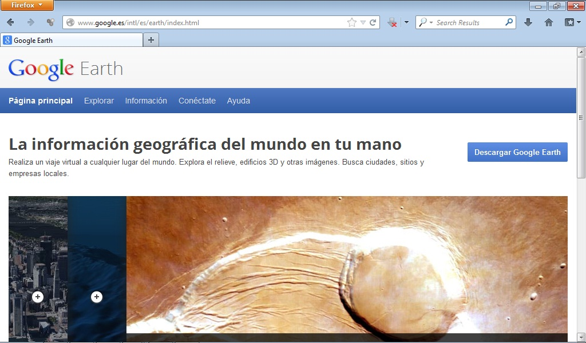

# Google Earth

Permite realizar un viaje virtual a cualquier lugar del mundo.

Es una herramienta de gran utilidad en el aula puesto que nos permite conocer diferentes países, ciudades, paisajes, etc.

Podemos descargar Google Earth desde: [http://earth.google.es/intl/en/](http://earth.google.es/intl/en/) 

 

Fig 4.23. Google Earth. Captura de pantalla.

## ParaSaberMas

Para aprender a utilizar Google Earth podéis visualizar el siguiente videotutorial.

 

https//www.youtube.com/watch?v=asloedgdhqI

