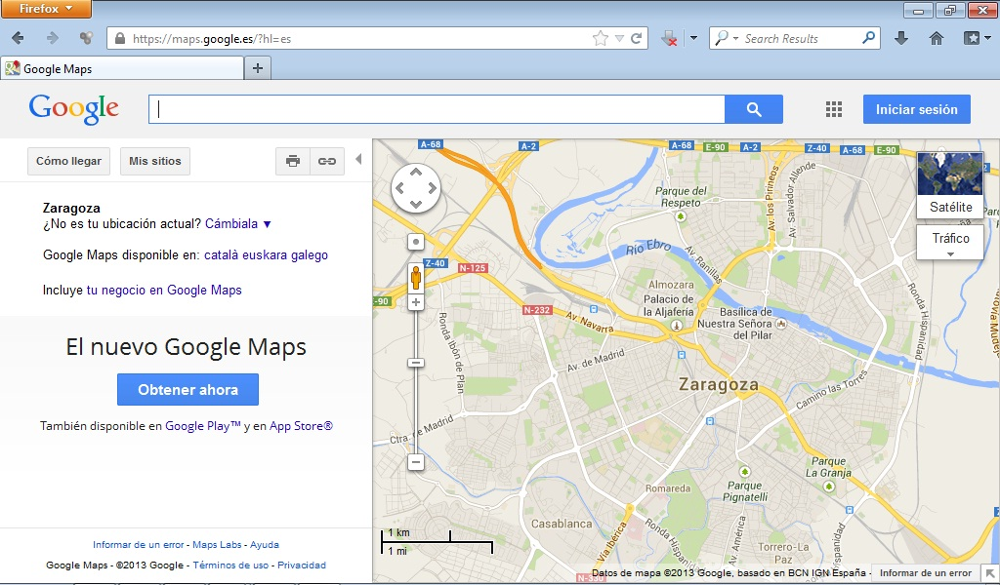

# Google Maps

Podrás calcular distancias kilométricas, preparar rutas y disfrutar del servicio Street View para tener una mejor orientación en las poblaciones urbanas.

Puede ser una herramienta de gran utilidad en el aula puesto que podemos trabajar la apreciación y el cálculo de distancias y la orientación en el mapa. Con Street View los alumnos pueden explorar las calles de diferentes ciudades. Además podemos ver imágenes de diferentes lugares del mundo.

Puedes acceder a Google Maps pinchando en: [https://maps.google.es/?hl=en](https://maps.google.es/?hl=en)

 

 
>**tip**
>## Para Saber Más
>
>Para aprender a utilizar Google Maps visualiza el siguiente videotutorial.
>
> 
>
>
>https//www.youtube.com/watch?v=zYwFy4ys0Es

 

