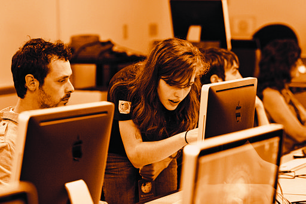

# MÓDULO 5: NAVEGACIÓN EDUCATIVA

- 5-1- Advanced editing workshop at Wikipedia in Higher Education Summit, 2011-07-09 - retouch for WMF annual report 2010-11 Fuente: http://commons-wikimedia-org/wiki/File:Advanced_editing_workshop_at_Wikipedia_in_Higher_Education_Summit,_2011-07-09_-_retouch_for_WMF_annual_report_2010-11-jpg CC

Como hemos visto **la cantidad de contenidos y recursos que existen en Internet es inmensa**, de ahí, que una de las principales retos que nos encontramos cuando se utiliza la red es** buscar, saber encontrar, filtrar y seleccionar de forma crítica y analítica la información** o herramientas que necesitamos. Este es un aspecto fundamental que debemos manejar y ensear a nuestros alumnos.

La importancia de este módulo radica ahí, en comenzar a orientar los pasos para acceder a recursos educativos recomendando algunas webs de referencia para comenzar a indagar en todo lo que nos ofrece Internet. Los primeros pasos los vamos a dar, por tanto, conociendo **portales, webs y blogs educativos**. Se ha tratado de presentar recursos con características variadas para que además, sirvan como modelo de qué tipo de webs podemos gestionar y cómo podemos aplicarlas en nuestra práctica profesional.

Por último, aunque la tendencia es a trabajar online, se hace referencia al **software educativo**, pues también es importante conocer y manejar algunos programas offline que nos permiten integrar las TIC en las aulas.

## Objetivos

Al finalizar el Módulo 5 seremos capaces de:

- Reconocer y movernos por algunos portales educativos.
- Localizar recursos educativos en la web.
- Utilizar un blog y conocer los distintos usos didácticas que nos ofrece.
- Conocer y descargar software educativo.

