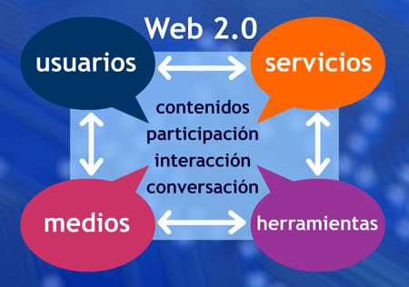

# MÓDULO 6: LA ESCUELA Y LA WEB 2.0

- 6-1- Web 2-0 y educación- Autor: Néstor Alonso- Fuente: http://www.flickr.com/photos/nestoralonso/2613103726/ CC

 

Este módulo es importante, porque como curso introductorio a Internet, hemos de saber que **la Web 2.0 es el presente de la red**. En módulos anteriores ya hemos ido dando pinceladas sobre qué es y qué papel tiene Internet en el aula y más concretamente el protagonismo que han cobrado las herramientas Web 2.0 en educación. En este módulo vamos a profundizar más en este recurso: cuáles son sus principios, qué nos ofrece, cómo se emplea, qué experiencias hay, qué herramientas hay,...

Además, os vamos a mostrar algunas de los **servicios Web 2.0 más habituales** y prácticos que se emplean en el aula y os sugeriremos otras muchas que es interesante que sepáis que existen.

 

## Objetivos

Al finalizar el módulo 6 serás capaz de:

- Comprender el concepto de Web 2.0 y su aplicabilidad en el ámbito educativo
- Conocer, seleccionar y manejar algunas herramientas web 2.0 con fines educativos
- Incluir los productos de servicios Web 2.0 en publicaciones como blogs

## Conocimiento previo

Y si la Web 2.0 es el presente, **¿cuál es el futuro de Internet en educación?** Web 3.0, Web 4.0,...

Bien, no somos adivinos, pero los [estudios sobre tendencias de Internet ](http://blog.educalab.es/intef/2013/06/24/informe-horizon-2013-primaria-y-secundaria-tecnologias-1-a-5-anos/)en el campo de la educación hablan, a corto plazo, de realidad aumentada, informática en la nube y aprendizaje móvil. Y para más adelante, sus previsiones incluyen cosas como impresión en 3D y laboratorios virtuales y remotos... ¿Parece ciencia ficción? pues no, estamos hablando de tan solo 5 años...

 

<iframe frameborder="0" height="511" marginheight="0" marginwidth="0" scrolling="no" src="http://www.slideshare.net/slideshow/embed_code/23454391" style="border-width: 1px 1px 0px; border-style: solid; border-color: #cccccc; margin-right: auto; margin-bottom: 5px; margin-left: auto; display: block;" width="479"></iframe>

## Para Saber Más

Si una vez terminado el módulo, te interesa el tema y sientes curiosidad por conocer más sobre la Web 2.0, puedes seguir profundizando con el curso de Aularagón: **"Herramientas Web 2.0"**

