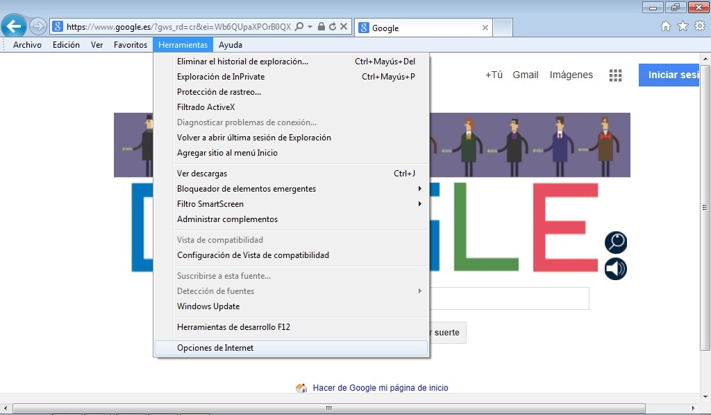
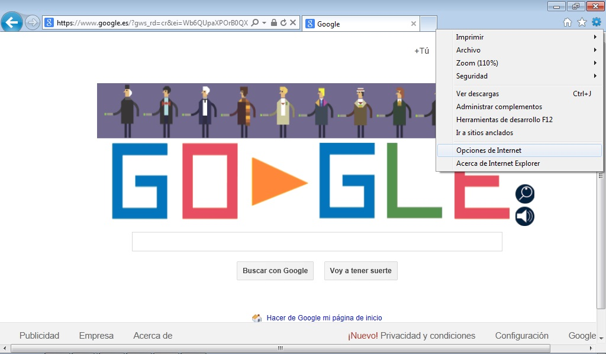
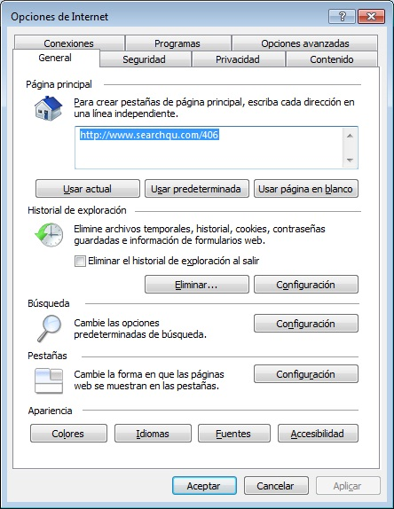
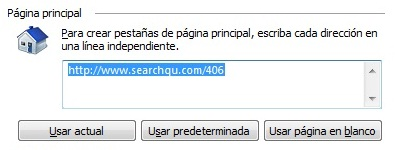

# Internet Explorer

Tenemos dos opciones para hacerlo:

1. Si está **activa** la barra de menú: Desde el menú Herramientas de la barra seleccionamos la última opción **Opciones de Internet**.

 2.13. Opciones de internet. Captura de pantalla.

 

2. Si **no está activa** la barra de menú: Accederemos pinchando en el icono que está a la derecha de la estrella según se muestra en la imagen.

 2.14. Opciones de internet 2. Captura de pantalla.

 

En cualquiera de los dos casos anteriores se nos abrirá la siguiente ventana.

 2.15. Opciones de internet 3. Captura de pantalla.

 

Nos fijamos en la primera parte de la ventana, que aparece bajo el título "Página de inicio".

 2.16. Página de inicio. Captura de pantalla.

 

En el espacio en blanco donde indica "Dirección " es donde se escribe la dirección de la página que queremos que nos muestre al arrancar Internet Explorer. Además, se nos ofrecen tres opciones más con los botones de la parte inferior:

- **Usar actual:** Si pinchamos en esta opción se asigna como página de inicio la que en ese momento está abierta en el navegador. Nos evita escribir la dirección y los posibles errores que ello implica. Para utilizar esta opción, previamente debemos abrir la página.

- **Predeterminada:** En este caso se asigna como inicio la página oficial de Microsoft.

- **Usar página en blanco:** Con esta opción no se asigna ninguna página como inicio. El navegador queda a la espera de que el usuario escriba la URL de la página que desde visitar en la barra de direcciones.

 

## Reflexión

<input class="feedbackbutton" name="toggle-feedback-51_9" onclick="$exe.toggleFeedback(this,true);return false" type="button" value="Mostrar retroalimentación"/>

### Retroalimentación

