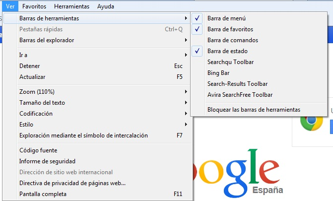
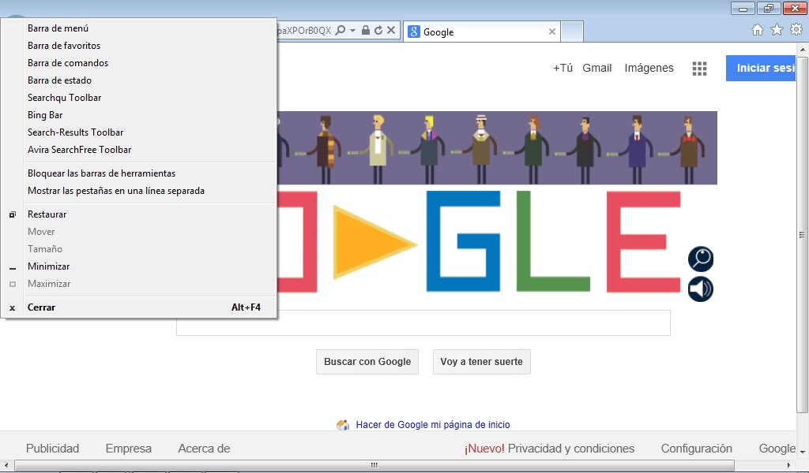

# Internet Explorer

Para **mostrar u ocultar** las diferentes barras en Internet Explorer, tenemos dos opciones:

1. Si está **activa** la barra de menú: Pincharemos en ver -&gt; barra de herramientas. Haremos click en las barras de herramientas que queremos que estén visibles.

	

2. Si **no está activa** la barra de menú: Pincharemos en la **e** de explorer que hay arriba a la izquierda y se abrirá la ventana que nos permite activar y desactivar las barras de herramientas tal y como se muestra en la imagen.

	

Además, Internet Explorer nos da la posibilidad de ver una **página web a pantalla completa**. Hace desaparecer temporalmente todas las barras, incluso la de menús, dejando una versión mínima de los botones imprescindibles. Esta opción se usa para ver página diseñadas para monitores de más resolución, sin necesidad de tener que movernos por el contenido con las barras de desplazamiento. Para activarla podemos apretar la tecla **F11 del teclado** o recurrir al menú **Ver / Pantalla completa**. Para recuperar el modo normal, de nuevo apretaremos la tecla  F11. Conviene recordarla ya que en modo pantalla completa no tenemos la barra de menús disponible.

