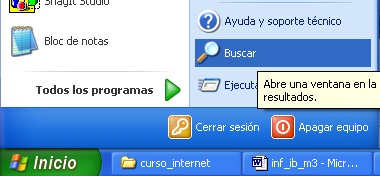
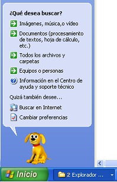
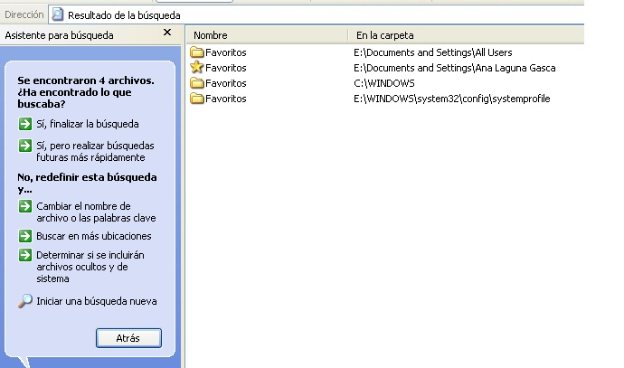
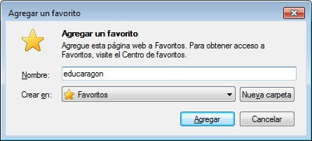
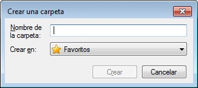
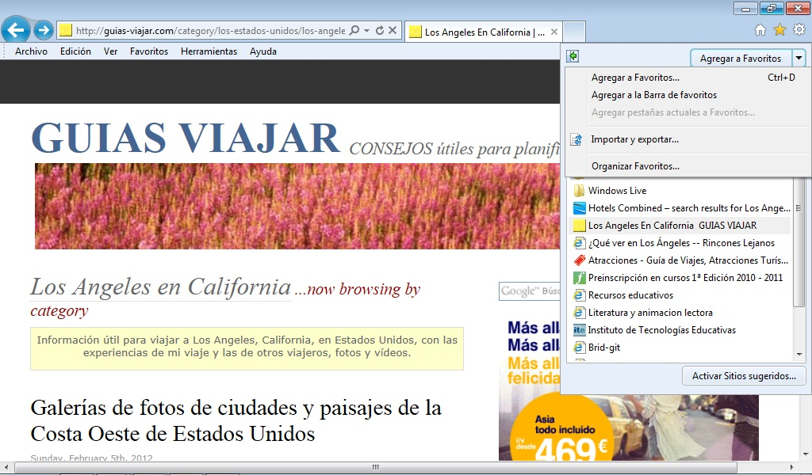
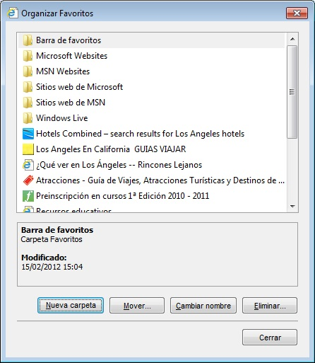

# Internet explorer

Aunque el acceso a esta herramienta se realiza normalmente a través del propio programa, conviene saber que **Favoritos** es, simplemente, **una carpeta incluida en la carpeta Windows, en la que se guardan Acceso directo a las páginas** que hemos visitado y a las que deseamos volver alguna vez. En el caso de que tengamos como sistema operativo Windows XP o Windows 7 la ubicación de Favoritos es algo diferente. Una opción para encontrar esta carpeta (y otras carpetas, como veremos más adelante) es ir a Inicio y en el menú que se despliega seleccionar Buscar --&gt; Archivos o carpetas como indica la imagen.

Al seleccionar esta opción nos saldrá la pantalla.

Aquí seleccionamos la opción Todos los archivos y carpetas  y nos saldrá otra pantalla en la que pondremos el nombre de la carpeta, en este caso Favoritos.

Al hacerlo salen los siguientes resultados:

Una vez realizada la búsqueda sabremos en qué lugar está situada la Carpeta objeto de la búsqueda (en este caso la carpeta Favoritos). 

Hay que hacer hincapié en que **en esta carpeta no se almacenan las páginas completas**, sino sólo las direcciones, de forma que, cuando queramos volver a visitar alguna de ellas, necesitaremos tener una conexión a Internet abierta.

Puesto que se trata de una carpeta, su gestión podría llevarse a cabo desde el **Explorador de Windows**. Sin embargo, es mucho más cómodo realizar esta gestión desde el propio navegador.

Como ya hemos comentado, aunque **Favoritos** es una subcarpeta de la carpeta **Windows**, y como tal, se podría gestionar desde el **Explorador de Windows**, es más cómodo manejarla desde las opciones que nos da el propio **Internet Explorer**. Estas son dos:

1. Si no tenemos activa la barra de menú: Pinchando en la estrella tal y como se muestra en la imagen.

	

2. Si **no tenemos activa** la barra de menú: Pinchando en la estrella tal y como se muestra en la imagen.

	

En ambos casos, tanto la forma de trabajar como los resultados son los mismos. 

### Crear la estructura de carpetas de Favoritos y añadir direcciones

Esta acción solo hay que llevarla a cabo cuando se prepara el sistema para empezar a almacenar direcciones y cuando queramos modificar la estructura. Para crearla y gestionarla debemos acudir al botón **Agregar a Favoritos**. Nos mostrará la siguiente ventana:

Por defecto nos agregará la página en la carpeta favoritos. También podemos crear una subcarpeta dentro de favoritos pinchando en la opción de nueva carpeta.

Podemos organizar las páginas en las diferentes carpetas. Para ello, pincharemos en** Organizar Favoritos **desde la flecha que hay a la derecha de** Agregar a Favoritos.**

 

Si queremos **Eliminar**, podemos seleccionar aquello que queremos suprimir y pinchar en el botón eliminar.

### Recuperar una dirección desde Favoritos

Para recuperar una página cuya dirección habíamos guardado, accederemos a **Favoritos,** donde podremos consultar los enlaces que tenemos guardados. Haciendo un clic sobre una carpeta se despliega su contenido y, haciéndolo sobre un enlace, la página correspondiente se descargará de nuevo.

