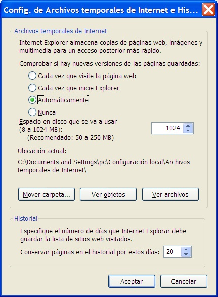

# Internet Explorer

Archivos temporales y navegación off line

Cuando visualizamos en nuestro PC una página web, los ficheros que contienen la información de la misma se han descargado almacenándose durante un tiempo en nuestro disco duro. Internet Explorer guarda esos ficheros en una carpeta llamada **ARCHIVOS TEMPORALES DE INTERNET **o **TEMPORARY INTERNET FILES** (depende de la versión usada) incluida en la carpeta **Windows**. **En el caso de que estéis trabajando con Windows XP podéis buscar las Carpetas de Archivos temporales de Internet usando la opción Inicio ****à Buscar de la que hemos hablado al referirnos a la carpeta Favoritos.**

 

Este hecho nos da la posibilidad de navegar sin tener una conexión a Internet establecida (navegación** off-line**). Este tipo de navegación implica ventajas e inconvenientes:

 
<td width="277">**Ventajas de la navegación ******off-line****</td><td width="277">**Inconvenientes de la navegación ******off-line****</td>

**Inconvenientes de la navegación ******off-line****
<td valign="top" width="277">- Al no requerir una conexión abierta a Internet, **no implica el pago de una llamada telefónica**.- Puesto que el navegador muestra el contenido de archivos residentes en el disco duro de nuestro ordenador, **la velocidad de navegación es muy alta**.</td><td valign="top" width="277">-  Vemos las páginas en nuestro ordenador tal y como eran cuando se descargaron. **Tenemos una copia sin actualizar**: si desde que nosotros la descargamos se han producido modificaciones en la página original, no las percibimos.- Tener mucho tiempo disponible sin conexión las páginas ya visitadas implica **ocupar un espacio en el disco duro** que no se puede usar para otros fines.</td>

 

A pesar de tener los archivos correspondientes a las últimas páginas visitadas en la carpeta de** Windows Archivos Temporales de Internet**, no podemos recuperar la página completa desde esta carpeta, ya que los archivos de todas las páginas guardadas están mezclados. Para poder recuperarlas, **Internet Explorer** nos proporciona una herramienta específica: el **Historial.**

** **

Acceso a las páginas del historial

Ya hemos comentado que la navegación **off-line** se puede llevar a cabo gracias al almacenamiento temporal en nuestro ordenador de los archivos correspondientes a las páginas visitadas. Este almacenamiento tiene lugar por partida doble. Por un lado, como ya hemos comentado, se guardan los archivos correspondientes a la página en la carpeta de **Windows Archivos Temporales de Internet**, pero su dirección, es decir, un acceso directo a esos archivos se guarda independientemente en la carpeta de Windows **Historial. **

Esta carpeta permite el acceso a las páginas en función de la fecha en que fueron visitadas. Para recuperar la página sin conexión, hay que pulsar la tecla control y la letra H. De esta manera se despliega una barra lateral en la que se ofrecen los accesos a las páginas visitadas organizados temporalmente por la fecha de la visita. También podemos acceder al historial pinchando en la estrella.

 

 Fig 2.34. Historial. Captura de pantalla.

 

Gestión del espacio dedicado a los archivos temporales y al** Historial**

Sabido esto, la siguiente pregunta es inevitable: ¿Pueden estas páginas ocupar tanta proporción del disco duro que llegue a bloquearnos su uso para otras aplicaciones? Si no se pusiera remedio, esto podría ocurrir. Pero **Internet Explorer** cuenta con un **sistema de control del espacio en disco que ocupan las páginas visitadas**. Este sistema permite que, de forma automática y según los criterios que nosotros introduzcamos, las páginas se vayan borrando para dar paso a otras nuevas sin necesidad de ocupar nuevo espacio. En este sentido, el usuario toma dos decisiones:

- **Qué cantidad de espacio del disco duro (número de Mb) se dedica a los archivos temporales**. Para ello, basta con acceder a la ventana **Opciones de Internet** que ya vimos en la Unidad 1 (menú **Herramientas/Opciones de Internet**).

 2.35. Historial 2. Captura de pantalla.

 

Desde el apartado **Historial de exploración** si pinchamos el botón **eliminar, **eliminaremos los archivos temporales, historial, cookies, contraseñas guardadas e información de formularios web.

Si le damos a la pestaña de **configuración** del **historial de exploración** podemos ver la ubicación de los archivos temporales de Internet, seleccionar el espacio que se va a usar y especificar el número de días que queremos conservar páginas en el historial. 

 2.36. Historial 3. Captura de pantalla.

 

Podemos comprobar si hay nuevas versiones de las páginas guardadas. Podemos elegir cualquiera de las siguientes opciones:

 
<td valign="top" width="175">Cada vez que se visita la página</td><td width="373">Nunca la toma del disco duro a no ser que no tengamos conexión. Con esta opción no conseguimos mayor velocidad de navegación, ya que siempre descargamos la página desde el servidor.</td>
<td valign="top" width="175">Cada vez que se inicia **Internet Explorer**</td><td width="373">Esta opción nos asegura que cada vez que nos conectamos y solicitamos la página en cuestión, la primera vez que la pedimos la descargamos del servidor (actualizada), mientras que si en esa misma sesión vuelvo a visitar la página, la veré desde el disco duro. De esta manera, me aseguro cierta actualidad (la página es tal y como estaba cuando yo me he conectado) y a la vez velocidad (salvo la primera vez, veo la página desde el disco duro). Es la opción más recomendable.</td>
<td valign="top" width="175">Automáticamente</td><td width="373">Con esta opción **Internet Explorer** comprueba si hay nuevo contenido cuando vuelve a una página ya vista en un día o una sesión anteriores. Con el tiempo, si determina que las imágenes de la página cambian poco, no las descarga, con lo que se acelera la navegación.</td>
<td valign="top" width="175">Nunca</td><td width="373">Siempre veo la página desde el disco duro, es decir, sin actualizar, tal y como estaba el primer día que la descargué. Me obliga a usar de vez en cuando el botón **Actualizar** para descargar manualmente de nuevo la página del servidor.</td>

 

 

- **Cuántos días se mantienen disponibles las direcciones de las páginas en el ******Historial****. Los accesos directos a las páginas cuyos archivos se encuentran en la carpeta **Archivos Temporales de Internet** son independientes de éstos y se almacenan en la carpeta **Historial**. Su gestión es independiente y permanecen en nuestro ordenador tantos días como les indiquemos en la zona **Historial** de la ventana **Opciones de Internet **(ver imagen anterior). Pasados estos días, los accesos directos desaparecen y, aunque los archivos correspondientes estén en **Archivos Temporales de Internet**, las páginas no son accesibles. El número de días óptimo se debe decidir en consonancia con el espacio en disco dedicado a los archivos temporales, y depende del uso que hagamos de este servicio:
<td width="219">**Si...**</td><td width="303">**...debemos...**</td>
<td valign="top" width="219">Si **no solemos navegar ******off-line**** a menudo...</td><td width="303">Dedicaremos **pocos días y poco espacio**. De este modo, cuando vayamos visitando nuevas páginas y se agote el espacio dedicado, se borrarán automáticamente los archivos de las más antiguas. A la vez, no estarán disponibles los accesos desde el historial porque habrán pasado más días de los señalados para guardarlas.</td>
<td valign="top" width="219">Si **hacemos uso frecuente de la navegación ******off-line****...</td><td width="303">Dedicaremos **más espacio y más días** en la configuración. De esta manera dispondremos de más páginas sin conexión asumiendo la menor disponibilidad del disco duro para otras aplicaciones.</td>

** **

