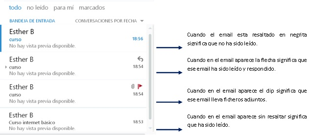

# Leer los correos

Dentro de la **Bandeja** de entrada, **como ya hemos dicho antes, nos aparecen los mensajes que hemos recibido. Delante del remitente de cada uno de los mensajes nos podemos encontrar los siguientes símbolos:

 

 

Para leer un correo hay que pinchar encima del mismo. En la zona de la derecha de la pantalla podremos leer el contenido del correo.

 

 

 

Si nuestro correo tiene ficheros adjuntos, lo veremos porque nuestro correo tendrá una línea en la que pone los nombres de los ficheros adjuntos.

Para descargar el fichero adjunto solo tenemos que pulsar sobre el mismo. Si, una vez leído el archivo deseamos guardarlo en nuestro ordenador utilizamos la opción de archivo guardar como.

Podemos utilizar la opción de **Vista previa**. Con** la vista previa **podemos ver el archivo sin necesidad de descargarlo en nuestro ordenador. Colocamos el ratón sobre el archivo adjunto y pinchamos en vista previa.

 

Una vez leído el correo tenemos varias opciones.

 

 

 

**Responder:** La utilizaremos si queremos dar una contestación al remitente del correo que acabamos de leer.

**Responder a todos**: Si el correo que acabamos de leer ha sido enviado a más destinatarios podemos enviar la misma respuesta a cada uno de ellos utilizando esta opción.

**Reenviar**: La utilizaremos cuando queremos enviar este mismo correo a un destinatario diferente.

 

**Podemos consultar los documentos que se muestran a continuación donde se nos explica como enviar y recibir mensajes:**

[Guía de inicio rápido de correo electrónico web](https://ast.aragon.es/sites/default/files/guia_de_inicio_rapido_de_correo.pdf)

[Web Puesto de Trabajo Digital de AST](https://ast.aragon.es/correo-electronico-y-herramientas-colaborativas)

 

