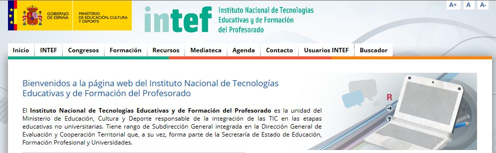
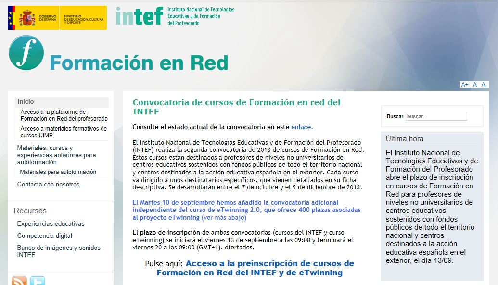

# Menú

* **INTEF:** Se explica qué es INTEF y cuales son sus objetivos. En el menú de la izquierda podemos encontrar enlaces a: becas de formación, convocatorias de premios a Materiales Educativos, webs de algunos centros educativos, y enlaces a los servidores de educación de las comunidades autónomas.

* **Congresos:** Enlaces a diferentes congresos en los que participa el MECD.

* **Formación:** Este es uno de los apartados más interesantes del portal. Sobre todo, porque dentro de los sitios de formación con los que enlaza (AulaMentor, CIDEAD, formación permanente) está el de [Formación en Red del Profesorado](http://formacionprofesorado.educacion.es/).

Como vemos, se organiza en 3 columnas, la de la izquierda es el menú de contenidos de la página, en la central nos aparecen las informaciones generales y a la derecha las últimas noticias.

Esta web es importante porque desde ella se accede a la [plataforma de Formación en Red del Profesorado](http://formacion.educalab.es/eva2013-14/), desde la que se realizan los cursos on-line que ofrece el INTEF en sus diferentes convocatorias a lo largo del curso. En esta plataforma podemos acceder (esquina superior derecha) con nuestro usuario y contraseña al curso que estemos realizando.

Además, en el menú de Formación en Red tenermos acceso a otros materiales formativos para autoaprendizaje (relacionados con las TIC) y al apartado de **RECURSOS**, del que destacamos, por un lado, ["Experiencias educativas"](http://formacionprofesorado.educacion.es/index.php/es/experiencias) con muchísimos enlaces a materiales que se han empleado en las aulas y se han compartido desde diferentes portales, programas o repositorios (AGREGA, eTwinning, JClic, Internet aula abierta, Joomla, Moodle, TIC en Ed. Infantil, PDI, Webquest,...), y por otro, el ["Banco de imágenes y sonidos"](http://recursostic.educacion.es/bancoimagenes/web/) donde encontraremos fotos, ilustraciones, sonidos y vídeos para utilizar libremente.

* **Recursos:** Nos lleva a una página donde podemos acceder a miles de [recursos](http://ntic.educacion.es/v5/web/profesores/) educativos clasificados en áreas curriculares o materiales complementarios (en le menú de la izquierda) o por etapas educativas (en el menú de la derecha). También tenemos enlaces a recursos para la formación del profesorado y a otros de cooperación internacional.

* **Mediateca:** Nos da acceso a todos los vídeos, imágenes  sonidos que nos ofrece INTED, además de a su canal de emisiones.

* **Otros apartados son:** Agenda (calendario con los eventos y fechas importantes), Contacto (con un formulario para realizar consultas) y Usuarios INTEF (para por ejemplo, solicitar una cuenta de usuario para incribirse en la plataforma de formación).

 

