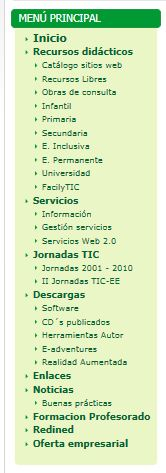
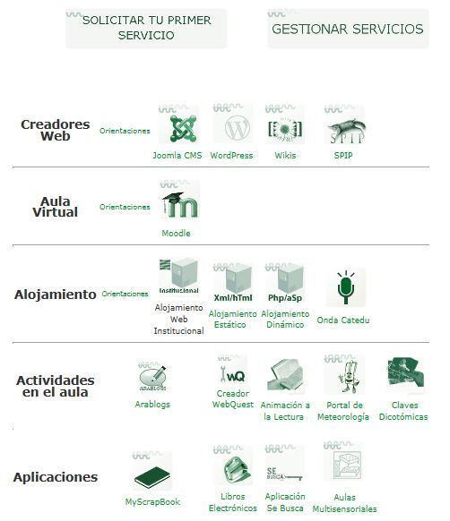
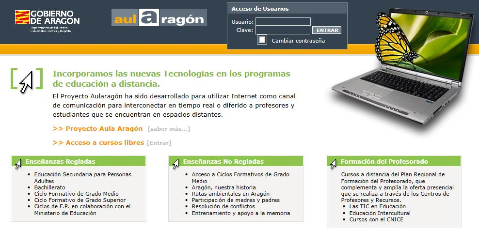

# Menú

El menú del CATEDU destaca por la sección **RECURSOS DIDÁCTICOS, **desde la que se tiene acceso a muchísimos recursos clasificados por contenidos o etapas. El "Catálogo sitios web" nos lleva a los [recursos propios del CATEDU ](http://www.catedu.es/catalogo/) (con casi 3000 recursos publicados) y a otros externos a éste, lo cual nos brinda la oportunidad de localizar infinidad de materiales didácticos que nos ayuden en nuestra práctica docente.

En este apartado también son muy recomendables sus enlaces a [recursos libres ](http://www.catedu.es/webcatedu/index.php/recursosdidacticos/recursos-libres)y a [obras de consulta](http://www.catedu.es/webcatedu/index.php/recursosdidacticos/obrasdeconsulta) (enciclopedias, RAE, GEA, museos, bibliotecas, atlas, SIGPAC,...).

Y además de los recursos clasificados por áreas, destacar el blog [FacilyTIC](http://www.catedu.es/facilytic/), en el que se ponen a disposición de la comunidad educativa ayudas y tutoriales de distintas herramientas para poder trabajar en el aula con las TIC de forma sencilla.

Fig. 5.9. facilyTIC. Captura de pantalla.

 Otro apartado importante del menú son los **SERVICIOS**. El CATEDU ofrece a los centros y profesores de Aragón una enorme variedad de servicios TIC para llevar a cabo la integración de las TIC en sus aulas. Entre ellos podemos encontrar: creadores web, aulas virtuales, alojamiento,  actividades en el aula y aplicaciones.

Fig. 5.10. Servicios CATEDU. Captura de pantalla.

Para utilizarlos hay que darse de alta en el CATEDU (rellenando un formulario) y solicitar el servicio que necesitemos para nuestra práctica docente.

Otro recurso interesante son los [servicios Web 2.0](http://www.catedu.es/webcatedu/index.php/servicios/serviciosweb20) (de los que hablaremos en el próximo móculo). Aquí nos los presentan y nos enlazan con la [Guia de Servicios Web 2.0](http://catedu.es/arablogs/blog.php?id_blog=1145) de Jose Ramón Olalla.

 En el apartado de **DESCARGAS** podemos encontrar gran variedad de [software](http://www.catedu.es/webcatedu/index.php/descargas/software), tanto general para cualquier usuario, como con fices específicamente educativos.

Recoge también apartados interesantes y novedosos como son las herramientas de autor (programas libres que nos permiten crear entornos de aprendizajes dinámicos, como este curso), e-adventure (crear videojuegos educativos) y realidad aumentada (una tecnología que nos permite representar, ver y manipular objetos virtuales tridimensionales). Que son algunas de las líneas TIC que tienen mayor proyección en el futuro.

Finalmente, destacar el apartado de **FORMACIÓN PROFESORADO**, desde el que se accede, entre otros sitios, a [Aularagon](http://www.aularagon.org/index.asp), el portal de formación on-line del Departamento de Educación, Universidad, Cultura y Deporte del Gobierno de Aragón.

Fig. 5.11. Aularagon. Captura de pantalla.

## parasabermas

En la [plataforma Aularagón ](http://www.aularagon.org/index.asp)se alojan muchísimos cursos de formación del profesorado. Desde el acceso a [cursos libres ](http://www.aularagon.org/asignaturas.asp)podemos consultar muchos de ellos.

Sin embargo, si quieres **consultar más cursos y sus materiales** relacionados con informática, educación intercultural, Internet en el aula o cursos relacionados con áreas o materias de Bachillerato y Ciclos Formativos o Educacion de Personas Adultas, puedes hacerlo accediendo al portal con las siguientes claves:

**Usuario:** visitante                      **Clave:** visitante

