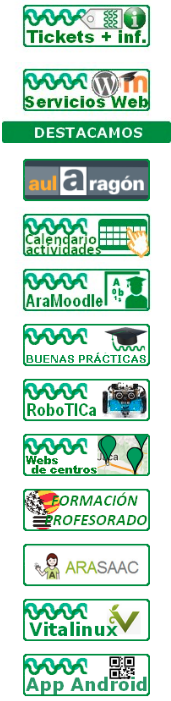
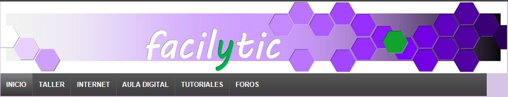
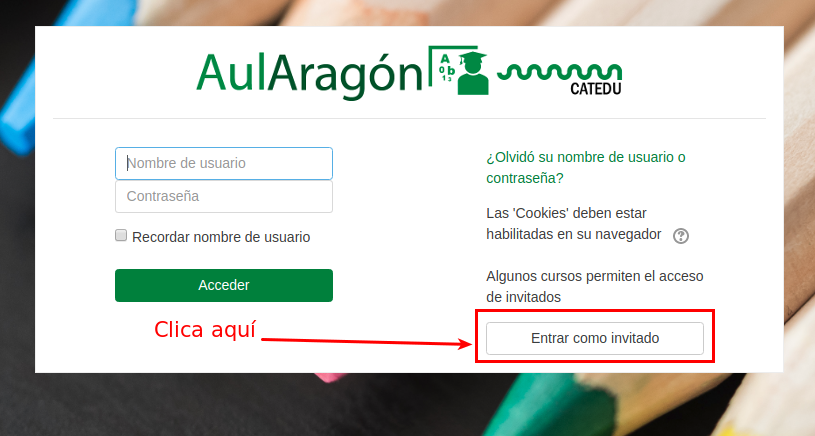

# Menú

El menú del CATEDU destaca por la sección **RECURSOS DIDÁCTICOS, **desde la que se tiene acceso a muchísimos recursos clasificados por contenidos o etapas. El "Catálogo sitios web" nos lleva a los [recursos propios del CATEDU ](http://www.catedu.es/catalogo/) (con casi 3000 recursos publicados) y a otros externos a éste, lo cual nos brinda la oportunidad de localizar infinidad de materiales didácticos que nos ayuden en nuestra práctica docente.

En este apartado también son muy recomendables sus enlaces a [recursos libres ](http://www.catedu.es/webcatedu/index.php/recursosdidacticos/recursos-libres)y a [obras de consulta](http://www.catedu.es/webcatedu/index.php/recursosdidacticos/obrasdeconsulta) (enciclopedias, RAE, GEA, museos, bibliotecas, atlas, SIGPAC,...).

Y además de los recursos clasificados por áreas, destacar el blog [FacilyTIC](http://www.catedu.es/facilytic/), en el que se ponen a disposición de la comunidad educativa ayudas y tutoriales de distintas herramientas para poder trabajar en el aula con las TIC de forma sencilla.

Otro apartado importante del menú son los [**SERVICIOS**](http://web.catedu.es/webcatedu/index.php/solicitud-servicio). El CATEDU ofrece a los centros y profesores de Aragón una enorme variedad de servicios TIC para llevar a cabo la integración de las TIC en sus aulas. Entre ellos podemos encontrar: creadores web, aulas virtuales, alojamiento,  actividades en el aula y aplicaciones.

Finalmente, destacar el apartado de **FORMACIÓN PROFESORADO**, desde el que se accede, entre otros sitios, a [Aularagon](http://moodle.catedu.es/), el portal de formación on-line del Departamento de Educación, Cultura y Deporte del Gobierno de Aragón.

>**tip**
>## Para Saber Más
>
>En la [plataforma Aularagón ](http://moodle.catedu.es/)se alojan muchísimos cursos de formación del profesorado. Puedes acceder al contenido o parte teórica de los cursos en [https://legacy.gitbook.com/@catedu](https://legacy.gitbook.com/@catedu). Utiliza su buscaro para encontrar el libro que más te interese. También puedes descargar los libros para leerlos en formato pdf, epub o mobi.

>
>
>Sin embargo, si quieres **los cursos y sus actividades** puedes acceder como invitado a [Aularagón](http://moodle.catedu.es/) sin necesidad de contraseña alguna.

>

