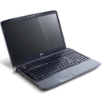

# Ordenador

 **El uso de un ordenador para recibir y enviar información a través de Internet es el caso más común pero**, actualmente, **se ha generalizado el uso de otros dispositivos** como móviles, tabletas, e-books, smart TV, relojes,...para acceder a contenidos y aplicaciones de la red, hasta el punto de que una gran parte de las conexiones que se realizan a Internet se hacen a través de ellos, por medio de redes inalámbricas o de conexiones móviles (3G y 4G).

Un ordenador actual de gama baja es suficiente para conectarse a Internet ya que el factor que más influye en la calidad del acceso a Internet es la velocidad de conexión, y ésta depende del tipo de conexión que utilicemos, no del ordenador personal. Si vas a utilizar tu ordenador solamente para navegar por Internet y como procesador de textos, no hace falta que te compres un superordenador, ahora bien, si vas a trabajar con programas de diseño gráfico o edición digital sí que necesitarás ordenadores de gama media o alta y con mucha mayor memoria RAM y buenas tarjetas de gráficas y de sonido.

En este momento, todos los equipos, ya vienen preparados con los dispositivos internos necesarios para conectarse a una red: una tarjeta de red para conectarse por cable (la más presente es Ethernet) y tarjeta inalámbrica interna para conectarse a WiFi.

## Dispositivos con acceso a Internet

