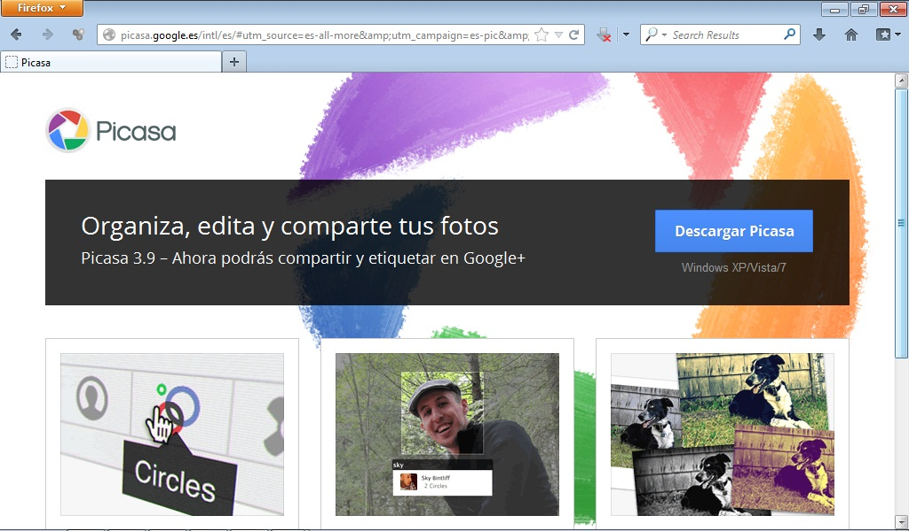

# Picasa

Picasa nos permite buscar, editar y compartir fotografías.

Es una herramienta muy útil para editar las fotografías que hagamos con nuestros alumnos y para poder compartirlas con ellos.

Para acceder a Picasa pincha en: [http://picasa.google.com/](http://picasa.google.com/)

 

 4.29. Picasa. Captura de pantalla.

## Para Saber Más

Si te interesa conocer el funcionamiento de Picasa visualiza el siguiente videotutorial.

 

https//www.youtube.com/watch?v=GaD04pwEutg

