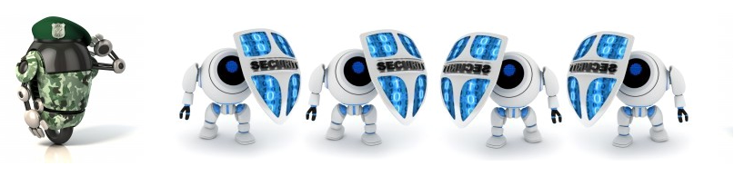

# Precauciones

 

Fig. 1.48. Antivirus. Imagen:   Ejército-Antivirus-Wikipedia. Fuente:   [http://es.m.wikipedia.org/wiki/Archivo:Ej%C3%A9rcito-Antivirus-Wikipedia.PNG](http://es.m.wikipedia.org/wiki/Archivo:Ej%C3%A9rcito-Antivirus-Wikipedia.PNG) Licencia Creative Commons

 

**Para evitar la presencia de virus** en nuestro equipo debemos tomar una serie de **precauciones**:

- Tener **actualizado el sistema operativo y el navegador web**.

 

- **Antivirus:** debemos poseer un buen antivirus y actualizarlo constantemente. Los antivirus que se comercializan actualmente, se pueden actualizar diariamente desde Internet. La función de un antivirus es localizar los virus, impedir que entren en nuestro ordenador y en última instancia eliminarlos.

 

- Tener **activado y actualizado un firewall**, que actúe como barrera de protección (cortafuegos) que impida el acceso de programas no autorizados.

 

- **Correo electrónico**: es un importante medio de propagación de los virus. Debemos observar las siguientes **precauciones**. No abras correos de desconocidos; fíjate en el asunto del correo; no abrir archivos adjuntos sin tener la certeza sobre su contenido o si dicho archivo tiene una doble extensión; desactiva la opción Vista previa que tienen algunos programas de correo; consulta tu correo utilizando el webmail, el correo a través de la web porque los servidores de correo tienen buenos filtros antivirus y porque podemos evitar que se nos grabe en nuestro ordenador.

 

- Antes de abrir **dispositivos externos de memoria** (pen drives, discos duros externos, tarjetas de memoria,...) o CD´s en nuestro ordenador es conveniente comprobarlos con el antivirus para evitarnos sorpresas. También existen programas antivirus "portables" que se pueden instalar en estos dispositivos para protegerlos. No sirve de mucho tener nuestro ordenador libre de antivirus si otras personas no hacen lo mismo y nos los pasan en estos soportes.

 

- **Páginas web:** hay que evitar entrar en páginas que no nos ofrezcan muchas garantías de seguridad. Desde los buscadores, los propios antivirus las tienen catalogadas y nos permiten o desaconsejan su visita, según sus criterios de seguridad, llegando incluso a bloquear el acceso a algunas. En ocasiones, son demasiado estrictos y no recomiendan acceder a páginas de confianza para nosotros (por ejemplo, a algunas del Gobierno de Aragón), en ese caso, es suficiente con añadir una excepción. Otras precauciones que debemos tomar con las páginas web son los banner que son esos letreros luminosos que aparecen en las páginas web, los complementos que nos proponen instalarnos, etc.

 

- **Descarga de archivos**: si nos descargamos archivos o programas de Internet es imprescindible que antes de abrirlos o instalarlos en nuestro ordenador los comprobemos con nuestro antivirus. Intentar evitar descargar contenidos a través de programas P2P, por la dificultad para conocer realmente su procedencia.

 

- Para evitar perder información importante es conveniente **hacer copias de seguridad** de aquellos archivos que realmente consideremos importante, y guardarlas en otros dispositivos externos a nuestro ordenador.

