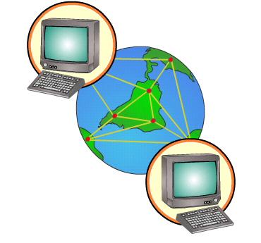

# Protocolo TCP/IP

Como ya se ha comentado, el intercambio de información entre los ordenadores integrados en la red de Internet se produce porque todos ellos **emplean un mismo lenguaje de comunicación de datos digitales**, a este lenguaje le llamamos** protocolo de comunicación TCP/IP.**

Estas siglas hacen referencia a **dos protocolos**[^1]: TCP (Protocolo de Control de la Transmisión) e IP (Protocolo de Internet). El **[TCP/IP](http://es.wikipedia.org/wiki/Protocolo_tcp/ip) define las normas sobre cómo deben viajar los datos a través de la red**, estableciendo la forma en que se transmiten de un ordenador a otro (TCP) y la mejor ruta y direccionamiento para que lleguen a su destino (IP).

Supongamos que tenemos dos ordenadores, A (origen) y B (destino), comunicados entre sí a través de Internet. La transmisión de datos del ordenador A al ordenador B se realizaría del siguiente modo: los datos que salen del ordenador A (origen) se dividen en paquetes de información que viajan de forma independiente. Cada paquete lleva la dirección de destino (ordenador B) y es encaminado por la mejor ruta disponible en cada momento. Al llegar todos a su destino (ordenador B) se juntan todos los paquetes de la transmisión y si falta alguno se le pide al ordenador A (origen) que lo envíe de nuevo. En el siguiente vídeo se explica cómo se produce este intercambio de información.

 

[^1]: Existen muchos más protocolos en Internet, que nos permiten utilizar diferentes servicios:  correo electrónico (SMTP, POP), acceso a páginas web (HTTP), transmisión de archivos (FTP, P2P), comunicación multimedia (VoIP),...

 

