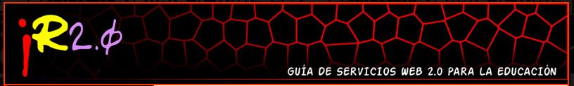

# Recursos

 

Como se ha explicado anteriormente, y vamos a comprobar en el resto del módulo, si algo nos ofrece la Web 2.0 son **herramientas y aplicaciones que facilitan las tareas de intercambiar, compartir y elaborar contenidos**.

Algunas son muy conocidas: Youtube, Wikipedia, Facebook, Twitter, Flickr, Slideshare, Prezi,... y hablaremos de algunas de ellas más adelante.

Pero **hay otras muchas** con aplicaciones muy variadas y, en ocasiones, específicas que resultan muy útiles en las aulas.

Para acceder a ellas de una forma guiada, basada en el análisis y experiencia previa de otros docentes con ellas, te recomendamos algunos **enlaces** a catálogos de recursos Web 2.0 que, seguro, te serán de gran utilidad:

* [J.R 2.0 - Guía de servicios Web 2.0. para la educación](http://www.catedu.es/arablogs/blog.php?id_blog=1145): Blog en el que Jose Ramón Olalla nos presenta un gran número de servicios web 2.0 clasificados por temas (almacenamiento, vídeo, imagen, líneas de tiempo, aulas virtuales, animaciones,...).

 Fig. 6.4. Blog JR 2.0. Captura de pantalla

 *[ FacilyTIC](http://www.catedu.es/facilytic/): Una página del CATEDU que pone a nuestra disposición ayudas y tutoriales de las herramientas básicas para integrar las TIC en nuestras aulas.

Fig. 6.5. FacilyTIC.Captura de pantalla

* [Blog Recursos Web 2.0](http://recursosweb2.blogia.com/): Una buena selección de recurso clasisficados por utilidades.

* [En la nube TIC](http://www.enlanubetic.com.es/): Blog en el que nos presentan recursos Web 2.0 y algunas aplicaciones de los mismos muy prácticas en las aulas, propuestas de uso, características,...

* [Catálogo de recursos didácticos de la Web 2.0](http://herramientasweb20.educvirtual.org/index.php?title=Portada): Los recursos están clasificados por tipos (vídeo, almacenamiento, wikis, fotos,...) y al entrar en cada categoría, nos da una explicación de la misma, nos ofrece diferentes enlaces a recursos y destaca algunos de ellos que explica con vídeos y tutoriales.

* [Recursos de software libre de Wikisaber](http://www.wikisaber.es/CentroDeRecursos/SoftwareLibre.aspx): Recursos con tutoriales.

