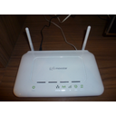
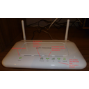
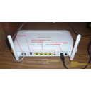

# Router

El** router** es el elemento que se utiliza para **proporcionar acceso a Internet o a una red informática** (independientemente del tipo de conexión: línea telefónica, el cable u otra). Antes, cuando las conexiones solían ser a través de la línea telefónica básica, esta labor la realizaba el MODEM, que permitía la comunicación entre ordenadores modulando las señales que éstos se enviaban, es decir, traduciéndolas de digital a analógico y viceversa. Además, a través de él, sólo se podía conectar un equipo, al contrario de lo que ocurre con el router, que permite, la conexión de diferentes dispositivos al mismo tiempo.

## ROUTER

La traducción de **router** al español, es enrutador o encaminador, es decir, literalmente que **marca rutas**. En concreto, **define los caminos más adeucados que han de seguir los paquetes de datos que se envían en la red para llegar del origen al destino**.

Por lo general, los que nos ofrecen los proveedores de internet, **suelen ser inalámbricos**, es decir, no es preciso que el ordenador se una por cable a ellos para conectarse a la red (aunque también puede hacerlo), porque funcionan al mismo tiempo como enrutadores, como puntos de acceso inalámbrico (disfribuyen la señal por ondas) y como switch (permitiendo también conectar varios equipos por cable, normalmente 4).

El router nos ofrece algunas **prestaciones** más:

-  Permite dos configuraciones: monopuesto (funcionaría como un modem) o multipuesto.

- Actúa como filtro, pues suele venir con un firewall integrado, presentado una primera barrera de seguridad en nuestra red local.

- Mientras está encendido, siempre está conectado a la red (el modem efectuaba conexiones puntuales a través de llamadas telefónicas sólo durante el tiempo que estábamos conectados).

- Para conectarnos a Internet simplemente tenemos que abrir un navegador de nuestro equipo.

En general, cuando se trata de una conexión o **red privada**, el router tiene una** contraseña** que es necesario introducir en nuestros equipos (ordenadores, móviles, tablets,...) para poder acceder a Internet. Cuándo la** red está abierta**, no es necesario ninguna clave para conectarse, por ejemplo, en las zonas **WiFi**.

## parasabermas

Si nuestro ordenador tiene una tarjeta de red inalámbrica, cuando detecte una de estas redes nos lo indicará en el siguiente icono (a la derecha en la barra de inicio):

 Fig. 1.26 Barra inicio-redes inalámbricas. Captura de pantalla

Si hacemos doble clic en ella nos mostrará la red o redes inalámbricas detectadas (Fig. 1.27), entonces, elegimos la nuestra y nos dará la opción de conectar (Fig. 1.28).

<td style="text-align: center;">Fig. 1.27 Hay conexiones disponibles. Captura de pantalla</td><td style="text-align: center;">Fig 1.28  Conectar. Captura de pantalla</td>

Al pinchar en el botón de conectar, se nos abrirá una pantalla donde nos pedirá nuestra clave de red:

Fig. 1.29 Escribir clave de red. Captura de pantalla.

Al ponerla, cambiará del estado de "redes inalámbricas disponibles" a "conectado". Si marcamos el recuadro que nos aparece de "conectar automáticamente", cuando el ordenador esté dentro del alcance de esa red, se conectará automáticamente a ella sin necesidad de que en cada ocasión le tengamos que introducir la clave manualmente.

Cuando estamos conectados, el icono de la barra de inicio se ve así:

Fig. 1. 30  Barra inicio. Captura pantalla

Si en cualquier momento queremos conocer los datos de la conexión, nos podemos poner sobre ese icono, y pulsando el botón izquierdo se despliegan todas las redes que detecta, indicando a cual estamos conectados. Al hacer clic en ella con el botón derecho nos permite elegir entre: desconectar, estado y propiedades. Elegimos esta última opción para llegar a estas ventanas:

<td style="text-align: center;">Fig. 1.31 Datos conexión wifi (captura de pantalla).</td><td style="text-align: center;">Fig. 1.32 Seguridad red inalámbrica (captura de pantalla).</td>

En la Fig. 1.32, si desplegamos el menú tipo de seguridad, veremos los tipos que hay: WEP, WPA-personal, compartido,... cada una de ellas tiene unas características diferentes. En general el proveedor de servicios nos da una clave WEP o WPA, que nos recomienda cambiar y personalizar para que nadie acceda a la red sin nuestro permiso.

Puedes seguir las rutas que hemos señalado y comprobar, si tienes una red inalambrica, qué tipo de seguridad tiene, cómo se llama,...

