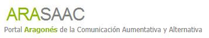

# Servicios destacados

El CATEDU ofrece a los centros y a los profesores una gran variedad de servicios, entre los que debemos destacar:

*** ARABLOGS:** [http://www.catedu.es/arablogs/](http://www.catedu.es/arablogs/)

- 5-12-  Arablogs- Captura de pantalla-

Desde hace años **el CATEDU cuenta con un servicio propio de blogs, diseñados con una visión educativa que permite que sean utilizados tanto por profesores como por alumnos**, incluso de Ed. Infantil o Ed. Especial, ya que incluyen configuraciones específicas para facilitar el acceso de todos ellos a esta herramienta, atendiendo así a la diversidad. Además, se pueden vincular a este portal blogs externos editados en plataformas como Blogger o Wordpress. Al entrar en Arablogs nos encontramos en la columna de la izquierda varios listados con los blogs más visitados y los últimos artículos publicados en blogs asociados a esta plataforma. En el portal también nos recomiendan algunos blogs destacados, hay un eficaz buscador que nos ayuda a localizar el blog que nos interese y nos informan de los últimos blogs que se han dado de alta.

Cualquier docente o centro de Aragón que desee abrir un blog en esta plataforma tiene que seguir los pasos que hemos indicado para cualquier servicio del CATEDU.

*** AARASAC:** [http://catedu.es/arasaac/index.php](http://catedu.es/arasaac/index.php)

- 5-13 - ARASAAC- Captura de pantalla-

El portal ARASAAC ofrece recursos gráficos y materiales para facilitar la comunicación de aquellas personas con algún tipo de dificultad en este área. Los **Sistemas Aumentativos y Alternativos de Comunicación** **(SAAC)** son formas de expresión  distintas al lenguaje hablado, que tienen como objetivo aumentar (aumentativos)  y/o compensar (alternativos) las dificultades de comunicación y lenguaje de  muchas personas con discapacidad.

- 5-14- El niño bebe agua- Captura de pantalla-

 Esta forma de comunicación incluye diversos **sistemas de símbolos**, tanto gráficos (fotografías, dibujos,  pictogramas, palabras o letras) como gestuales (mímica, gestos o signos  manuales) y, en el caso de los primeros, requiere también el uso de **productos de apoyo**. Los diversos  sistemas de símbolos se adaptan a las necesidades de personas con edades y  habilidades motrices, cognitivas y lingüísticas muy dispares.

El portal tiene un menú muy completo en el que además de explicarnos cómo funcionan los Sistemas Aumentativos y Alternativos de Comunicación (SAAC), nos ofrece [catálogos](http://catedu.es/arasaac/catalogos.php) (pictogramas, fotografías y vídeos), un buscador de materiales, interesantes [herramientas online](http://catedu.es/arasaac/herramientas.php), [software](http://catedu.es/arasaac/software.php) que usa recursos gráficos de ARASAAC y [ejemplos de usos ](http://catedu.es/arasaac/ejemplos_uso.php)que se han dado a estos recursos en distintos ámbitos comunicativos y sociales.

- 5-15- Herramientas online ARASAAC- Captura de pantalla-

Hemos de resaltar, que este proyecto ha recibido importantes premios y reconocimientos por su labor promoviendo entornos en los que se respete y se tenga en cuenta la diversidad y facilitando la integración de todos en la sociedad. Siendo uno de los más destacados su candidatura a los Premios Principe de Asturias 2.013.

 

*** FACILIT@MOS:** El proyecto **facilit@mos** se constituye como un espacio virtual donde la comunidad educativa localiza, ofrece, analiza, complementa, clasifica y valora recursos educativos para su utilización en las aulas, y propone modelos de utilización de los mismos. 

- 5-16- Facilit@mos- Captura de pantalla-

Los docentes que moderan cada uno de los espacios del proyecto Facilit@mos coordinarán el trabajo de elaboración de propuestas didácticas donde se utilicen dichos recursos. **Estas propuestas didácticas, evolucionarán desde metodologías de menos a mayor grado de innovación** según los criterios establecidos en el decálogo de principios metodológicos del proyecto Facilit@mos que pretende ser un **proyecto de la comunidad educativa y para la comunidad educativa**. Esta última es precisamente la seña de identidad del proyecto.

- 5-17- Esquema grupos de trabajo de Facilit@mos- Captura de pantalla-

## Para Saber Más

Otro enlace interesante de la parte de destacados son las **asignaturas y Unidades Didácticas para ESO y Bachillerato** ya preparadas que nos ofrecen desde su página en la plataforma [E-ducativa](http://e-ducativa.catedu.es/44700165/sitio/index.cgi). Allí podemos encontrar un gran número de recursos ya elaborados y clasificados por áreas, además de enlaces a videotutoriales y manuales para los profesores.

El CATEDU tiene también enlaces a otros importantes repositorios de recursos como[ Agrega](http://cas-agrega.catedu.es/cas/login?service=http%3A%2F%2Fagrega.catedu.es%2Fvisualizadorcontenidos%2Fj_acegi_cas_security_check%3Bjsessionid%3DE65DC31CF3810620A81EED41EDB1FCF6), además de algunos portales con recursos específcos:

-[ Educación para la salud](http://eps.aragon.es/). Recursos para la comunidad educativa.

-[ El Pupitre e Intranet](http://catedu.es/intranetypupitre/). Dos herramientas para trabajar en red en el aula.

