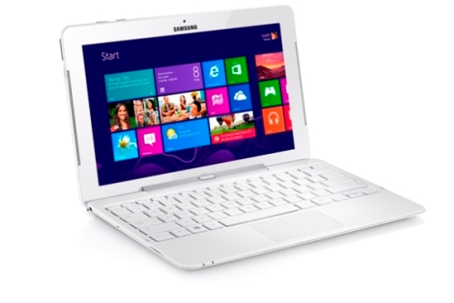

# Síntomas

Ya conocemos las amenazas más habituales, pero,** ¿cómo podemos saber si nuestro ordenador está infectado por un virus?**

Los síntomas por los que podemos sospechar que nos han infectado son múltiples, generalmente porque el equipo ya está dañado. Entre estos síntomas, aunque no siempre pueden deberse a la acción de programas maliciosos, podemos destacar los siguientes:

- El ordenador va muy lento, se bloquea o se apaga frecuentemente.
- Nuestro disco duro tiene poco espacio libre y no tenemos tanto espacio ocupado.
- Desaparecen archivos de nuestro ordenador
- Disminuye la memoria RAM disponible en el ordenador.
- Aparecen mensajes extraños.
- Algunas teclas funcionan mal.

Estos síntomas **se producen cuando el malware ya ha afectado a nuestro ordenador**. Si conocemos el funcionamiento de nuestro ordenador, enseguida podemos darnos cuenta de que algo no funciona correctamente.

