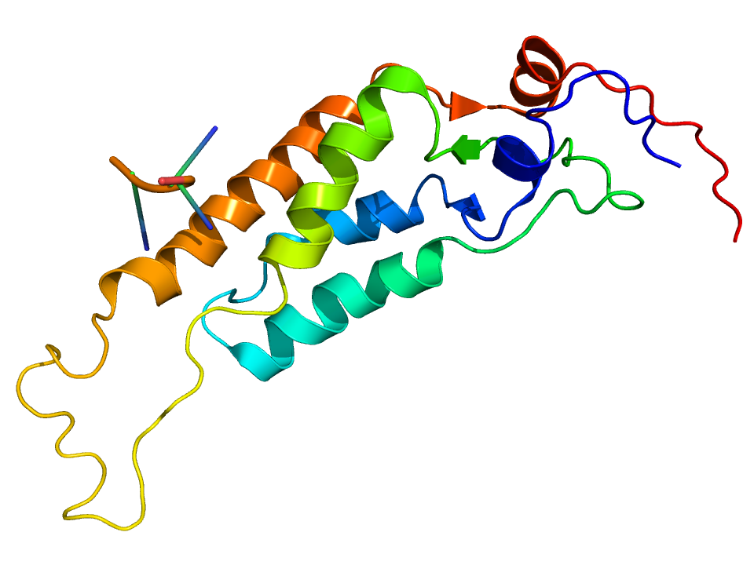

# Tipos: virus informáticos, gusanos, troyanos, spyware y adware

 

* **Virus informáticos**: son programas, habitualmente ocultos dentro de otro programa, correo electrónico, página web... Se ejecutan automáticamente, incrustando su código malicioso dentro de otros programas a los que infectan, de modo que ese programa pasa a ser portador del virus y por tanto una nueva fuente de infección. Se han creado con la intención de modificar o dañar determinados archivos del sistema, pero no tienen la capacidad de copiarse a sí mismos.

 

* **Gusanos:** Son programas que realizan copias de sí mismos (se replican) alojadas en diferentes ubicaciones del ordenador, con objeto de colapsar el equipo o las redes informáticas. A diferencia de los virus, éstos no afectan directamente a los archivos ya que su objetivo es propagarse y afectar al mayor número de ordenadores posible. Como curiosidad, sus creadores los suelen ocultar bajo nombres de temas populares en la red (sexo, actualidad, famosos, celebraciones,...) y las mayores infecciones se asocian a días señalados: San Valentín, Halloween, Navidad,...

 

* **Troyanos:** Su nombre procede de la historia del "Caballo de Troya" de la Odisea. Es un tipo de malware que, para acceder a los equipos informáticos e infectarlos, se disfraza de archivos o programas benignos y legítimos (fotos, música, archivos de correo,...) con el objeto de robar información confidencial. Están diseñados para que el atacante pueda acceder a los equipos afectados de forma remota y usarlos "sin permiso".  Los troyanos están compuestos por 2 archivos: uno actúa como cliente, enviando las órdenes, y el otro como servidor, recibiéndolas, ejecutándolas y devolviendo la información solicitada. Dadas sus características, pueden pasar mucho tiempo ocultos en nuestro ordenador sin que los detectemos.

 

* **Spyware:**Con este nombre se designa a todo tipo de software que, de forma encubierta, utiliza nuestra conexión a Internet para extraer datos e información sobre las páginas web que visitamos, los programas que utilizamos, etc. Y todo esto lo hace sin preguntarnos y sin que nosotros nos demos cuenta. Estos datos son enviados a alguna empresa que los utiliza, por ejemplo, para enviarnos publicidad no deseada sobre ciertos productos, basándose en la información que han recogido de nuestro ordenador. Prácticamente en todos los ordenadores hay spyware y son difíciles de detectar porque los antivirus no los detectan y no suelen provocar ningún efecto dañino en el ordenador.

* **Adware:** A veces funciona junto a un spyware, pero la función del adware no es espiar al usuario sino que lo que hace es modificar la página de inicio, instalar barras en el navegador y lanzar publicidad (los llamados pop-ups) continuamente. Las vías por las que se suelen instalar en nuestro ordenador son sobre todo por visitar páginas web. Alguno de estos adware son muy dañinos y pueden llegar a bloquear el ordenador. Incluso puede ocurrir que la única opción sea formatear el ordenador y por lo tanto perderíamos nuestro trabajo (si, como ya he dicho antes, no hemos tenido la precaución de hacer copias de seguridad).

