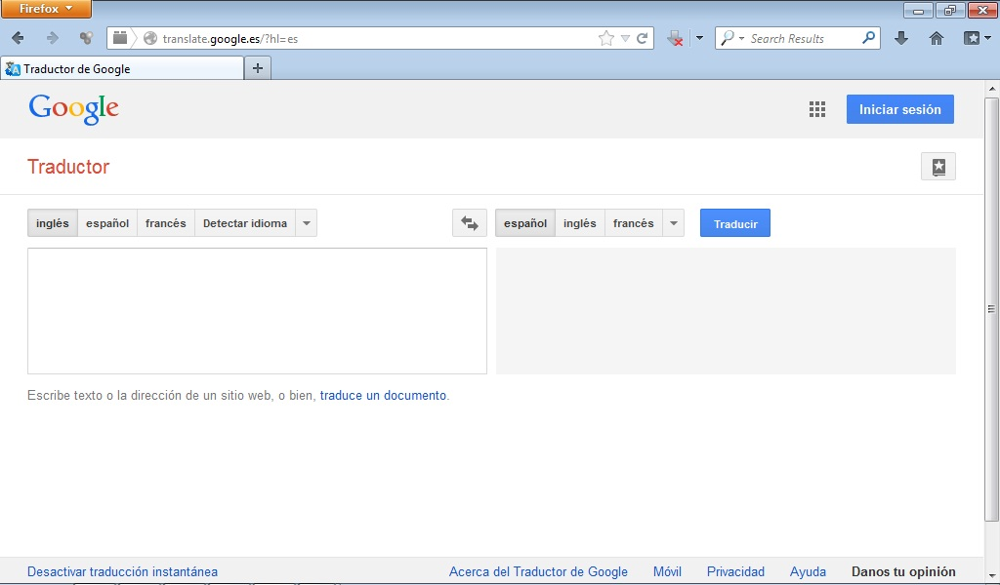

# Traductor de Google

El traductor de Google permite traducir texto, páginas web y archivos a más de 50 idiomas de forma instantánea. Podemos decir que es un traductor de idiomas muy útil.

Además, puede ser una herramienta de trabajo muy interesante en el aula puesto que podemos trabajar de manera intercultural aprendiendo a decir palabras u oraciones en diferentes idiomas, facilitando la integración de nuestros alumnos y el conocimiento de otras culturas.

Lo podemos utilizar pinchando en: [http://translate.google.es/?hl=en](http://translate.google.es/?hl=en)

 

 4.21. Traductor de Google. Captura de pantalla.

## Para Saber Más

Podemos ver el siguiente videotutorial para conocer el funcionamiento del traductor de Google.

 

https//www.youtube.com/watch?v=mVUt7cEkzqw

