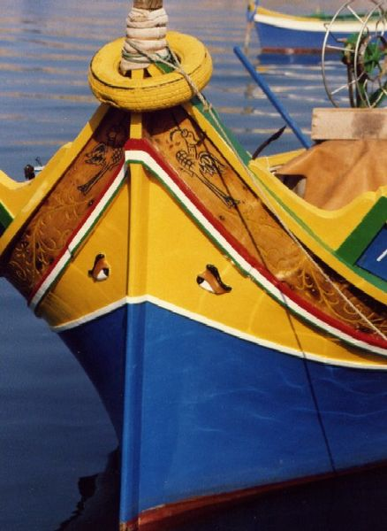

# U1. VISITANDO LAS PRIMERAS PÁGINAS

Vamos a empezar a navegar pon nuestras primeras páginas de internet. Por ello, a lo largo de esta unidad vamos a trabajar diversos conceptos básicos que son necesarios conocer antes de comenzar.

Comenzamos nuestro viaje...

 Fig 2.1. Malta 13 dhajsa. Autor: jkb. http://commons.wikimedia.org. GNU Free Documentation License.

 

 

