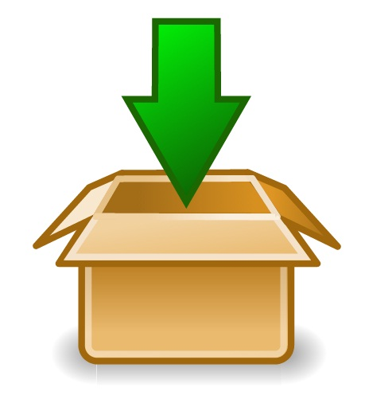

# U3. DESCARGA DE MATERIALES

Una de las funciones más habituales que podemos realizar al visitar páginas web es **descargarnos** aquellos **materiales** que nos interesen para nuestro trabajo. En lo que llevamos de curso, hemos visto cómo descargarnos programas de la red. Por eso, nos vamos a dedicar ahora a explicar cómo descargarnos **imágenes y páginas web desde Internet**.

 4.30. Download. Autor: Kuba. http://openclipart.org/detail/87799/download-package-by-kuba. OpenClipArt.

