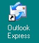

# U3. SOFTWARE DE GESTIÓN DE CORREO

Un gestor de correos electrónicos es un programa que nos va a permitir gestionar o trabajar con una o varias cuentas de correo electrónico a la vez.

Por tanto, desde este programa podemos consultar, contestar e-mails, etc., sin necesidad de acceder a la web de cada una de nuestras cuentas de correo electrónico. Así la tarea es mucho más cómoda y rápida.

Existen multitud de gestores de correo electrónico. En esta unidad vamos a trabajar con Outllok Express y Thunderbird.

1.26. Iconos. Captura de pantalla.

