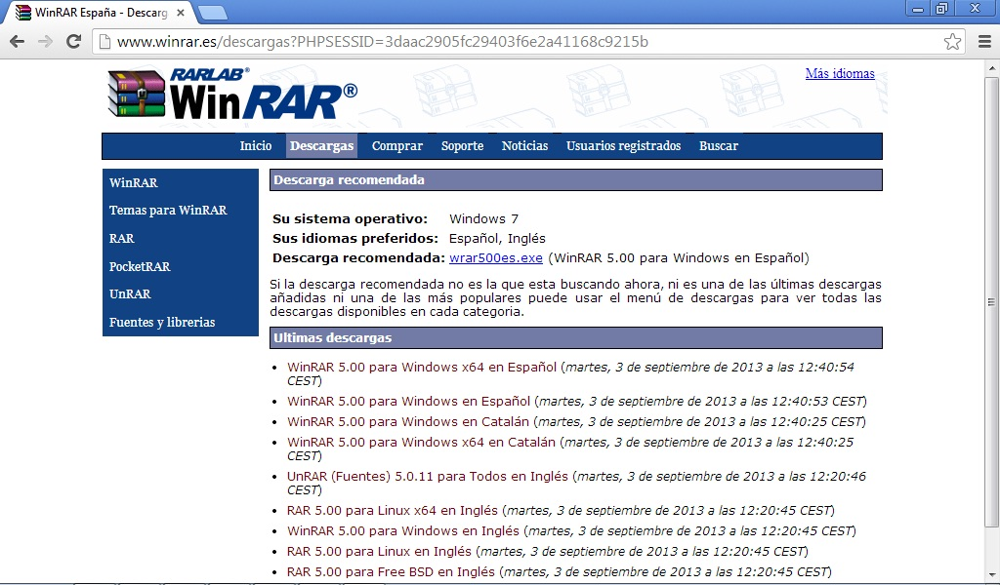

# U4. COMPRIMIR ARCHIVOS: WINRAR, WINZIP y 7ZIP

Un archivo comprimido es como una caja en la que puedes guardar cualquier tipo de información (imágenes, documentos, música...), esta información se codifica y se comprime para ocupar un menor espacio, por lo que resulta mucho más fácil transportar tus archivos, enviarlos a través de internet o incluso almacenarlos.  Debes pensar en el símil de la caja: **puedes ver lo que hay dentro, pero para trabajar con ello antes tendrás que sacarlo**.  En esta unidad solo pretendemos que aprendas a utilizarlo, pues adquieren mucha importancia cuando navega por internet (descargas, correo electrónico,…).  Los programas más utilizados son WinRAR, Winzip y 7Zip. Busca siempre la versión gratuita.

 

WinRAR se trata de una herramienta bastante completa, te da opción a comprimir en un archivo .ZIP (compatible) o alcanzar un mayor grado de compresión almacenando tus archivos en un .RAR. En cualquier caso, la apariencia de ambos programas es muy similar, por lo que el tutorial te servirá para los dos, pero me voy a apoyar en Winrar.Ten en cuenta que al instalar el programa compresor, Windows asocia el tipo de archivo comprimido al programa, por lo tanto cada vez que intentes abrir un archivo se abrirá la ventana del programa mostrando el contenido del archivo.

Winzip comprime tus archivos en formato .ZIP, un formato muy cómodo pues no te hará falta ningún programa complementario para descomprimirlo, ya que Windows XP soporta este tipo de archivos y gestiona su descompresión automáticamente (únicamente deberás decirle en que carpeta ubicar tus archivos tras descomprimirlos). WinRAR, sin embargo, soporta dos tipos de compresión diferentes: .ZIP y .RAR.

7ZIp es un programa libre para la compresión de datos que usa el nuevo formato de compresión 7z. Este alcanza porcentajes de compresión mejores que el resto de programas sin perder en calidad ni velocidad. Además, 7-Zip soporta otros más comunes como ZIP, CAB, RAR, ARJ, GZIP, TAR y otros, de manera que lo puedes usar con prácticamente cualquier fichero comprimido que encuentres.
