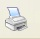

# U5. IMPRESIÓN DEL CONTENIDO DE UNA PÁGINA

Para completar el uso básico de la barra de herramientas, vamos a ver cómo utilizar el botón **Imprimir** . 

Como es de suponer, este botón nos permite imprimir el contenido de la página web que estamos viendo en ese momento en el navegador. Al pinchar en este botón se produce la impresión de la página según las condiciones predeterminadas.

