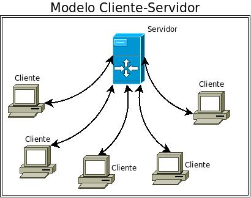

# UNIDAD 1: QUÉ ES INTERNET Y CÓMO FUNCIONA

Internet está presente de forma cada vez mayor en nuestro entorno personal y laboral, pero, ¿sabríamos explicar, exactamente, qué es Internet? En realidad, se trata de un concepto muy amplio y técnico qué vamos a simplificar en la siguiente definición:

> “Internet está formado por una gran cantidad de ordenadores que intercambian información entre ellos de forma descentralizada, es decir, es una gran red mundial de ordenadores. Estos ordenadores pueden comunicarse entre sí porque están unidos a través de conexiones (de distinto tipo: redes telefónicas, fibra óptica, WiFi, vía satélite, banda ancha móvil, cables de red local, etc.) y gracias a que utilizan un lenguaje o protocolo común, el TCP/IP.”

Sin embargo, aunque Internet está formado por millones de ordenadores conectados entre sí, no todos ellos tienen la misma importancia ni las mismas características.

Por un lado, están los **Ordenadores Servidores [^1] **(también denominados **Remotos o Host**) que son los que ofrecen la información y los servicios a los demás usuarios de la red. Son ordenadores muy potentes (con discos duros de gran capacidad) ya que en ellos reside toda la información disponible en Internet.

**Los Servidores tienen acceso directo a Internet y su conexión es permanente** (durante las 24 horas del día) ya que los demás usuarios pueden solicitar sus servicios en cualquier momento.

Los Servidores son los ordenadores remotos que  disponen de programas específicos, tales como el software del servidor, que les permite lanzar la información a la red, y proveen los datos solicitados por parte de los navegadores de otros ordenadores de la red (ordenadores clientes).

Los **Ordenadores Clientes **(o **Locales**) son los ordenadores que utilizamos para acceder a esos servidores en busca de información. Por ejemplo, los ordenadores de una red local, los ordenadores de uso doméstico, los ordenadores de un aula, y otros dispositivos con acceso a Internet (móviles, smartTVs, etc.).

** Los ordenadores clientes se sirven de Internet para obtener la información, y se conectan a la red a través de un servidor.** Las empresas que suministran este servicio de conexión se denominan proveedores (p.e.: Movistar).                    

[^1]: Los hay de muchos tipos (web, de archivo, de correo,...) y ofrecen diferentes servicios. En este caso, al hablar de servidor lo hacemos en el sentido de host (anfitrión), servidores que nos permiten el acceso a la red, a la transferencia de archivos,  a bases de datos, a otros servidores web, etc.