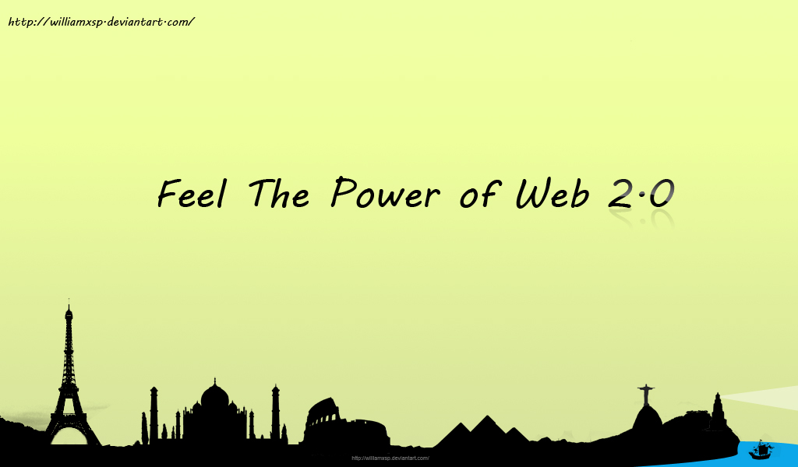
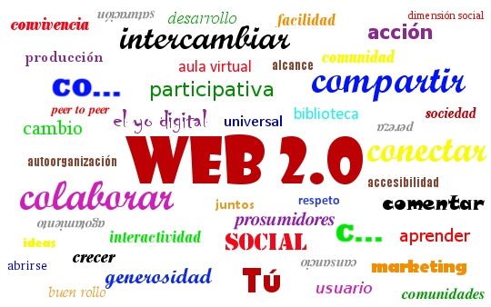

# UNIDAD 1: WEB 2.0

 

La [Web 2.0](http://es.wikipedia.org/wiki/Web_2.0) o Web Social  engloba un gran número de espacios web basados en el principio de una **comunidad de usuarios**. Es un término que se  refiere a una segunda generación en la historia de los sitios  web. Abarca una amplia variedad de redes sociales,  blogs, wikis y servicios multimedia interconectados **cuyo propósito es el intercambio ágil de información** entre los usuarios **y la colaboración en la producción de contenidos**. Todos estos sitios utilizan la  inteligencia colectiva para proporcionar servicios interactivos en la  red donde el usuario tiene control para publicar sus datos y  compartirlos con los demás.

 

 

El uso que se hacía de Internet anteriormente (**Web 1.0**) estaba **orientado más a la búsqueda de información y consumo de contenidos ya elaborados  y cerrados**. Con la aparición de determinadas herramientas web se ha pasado a elaborar el conocimiento y los contenidos (de calidad) de forma colectiva basándose en las **4 C: comunicarse, compartir, colaborar y confiar**. Ante la necesidad de evidenciar este cambio, surge en 2004 el concepto Web 2.0. y desde entonces, estas dinámicas y las herramientas que lo sustentan no han hecho más que multiplicarse y evolucionar, y ya se habla de [Web 3.0](http://es.wikipedia.org/wiki/Web_3.0) (¡e incluso [Web 4.0](http://www.slideshare.net/jessikitaaaa/qu-es-la-web-30-y-40-12143743)!).

>**info**
>### Importante
>
>* Concepto de Web 2.0: [http://www.ite.educacion.es/formacion/materiales/155/cd/modulo_1_Iniciacionblog/concepto_de_web_20.html](http://www.ite.educacion.es/formacion/materiales/155/cd/modulo_1_Iniciacionblog/concepto_de_web_20.html)
>
>* Herramientas generales de Web 2.0:
>[http://www.ite.educacion.es/formacion/materiales/155/cd/modulo_1_Iniciacionblog/algunos_ejemplos_de_iniciativas_web_20.html](http://www.ite.educacion.es/formacion/materiales/155/cd/modulo_1_Iniciacionblog/algunos_ejemplos_de_iniciativas_web_20.html)

 

