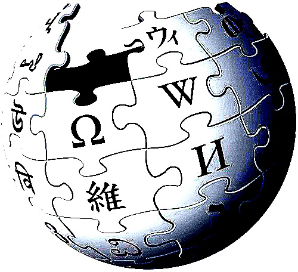

# Wikis

- 1-43- Representacion_de_un_globo wikipedia- Fuente: http://es-m-wikipedia-org/wiki/Archivo:Representacion_de_un_globo-jpg Licencia Creative Commons

 

En hawaiano"wiki-wiki" significa rápido. Este concepto hace referencia a páginas cuyo contenido se crea, edita y desarrolla a través de la colaboración de varios usuarios que pueden añadir, cambiar o eliminar información. En este tipo de páginas lo más importante es el contenido, la información, los enlaces a otros conceptos relacionados,... más que la estética, que suele ser sencilla. Además su edición no entraña dificultades y es rápida. La más conocida e importante es [Wikipedia](http://es.wikipedia.org/wiki/Wikipedia:Portada), pero por su fácil edición y su filosofía colaborativa, las wikis son una herramienta muy útil en educación.

 

https//www.youtube.com/watch?v=jIgk8v74IZg

 

Un ejemplo de su uso en las aulas es [Cineando](http://cineando.wikispaces.com/), una wiki elaborada por Silvia Andrino en la que participan alumnos de Primaria del CEIP Augusta Bílbilis de Calatayud, que investigan, a partir de webquest, sobre diferentes aspectos de la historia y evolución del cine. Premiada en 2012 por su valor como material educativo innovador.

Hay varios portales que nos permiten crear nuestra propia wiki para trabajar en el aula: [Wikispaces](http://www.wikispaces.com/), [Wiki.com](http://www.wiki.com/), ...

 

 

